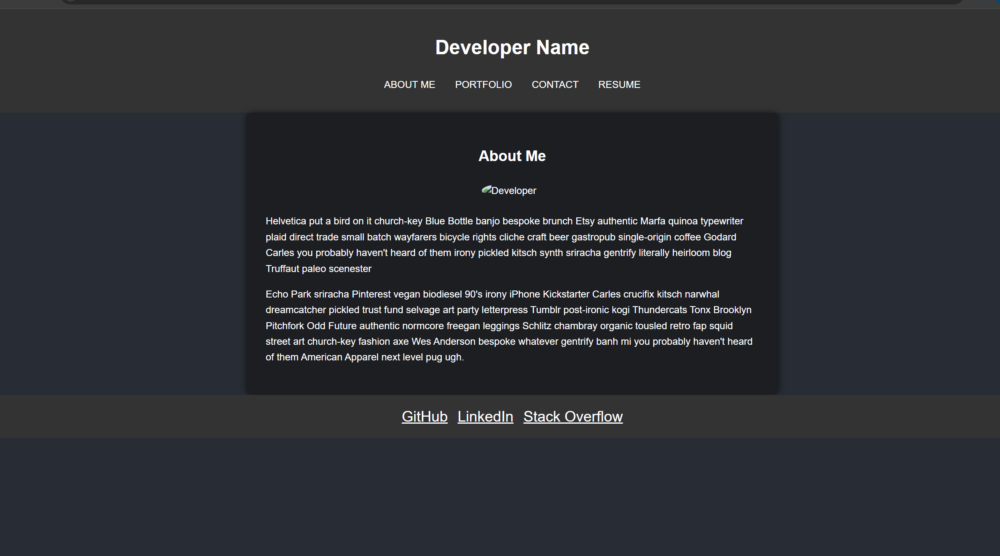
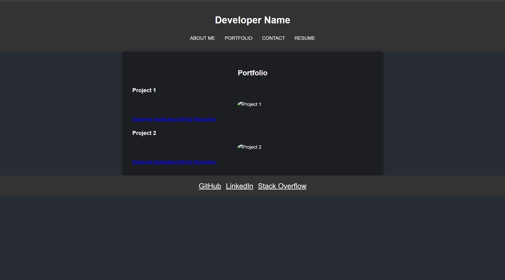
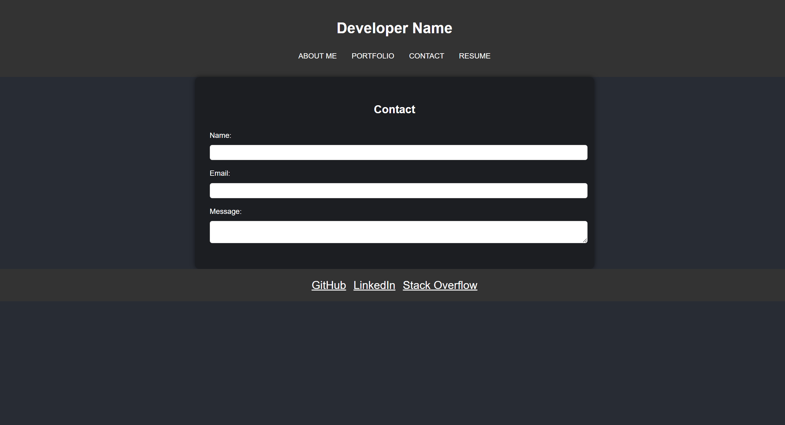
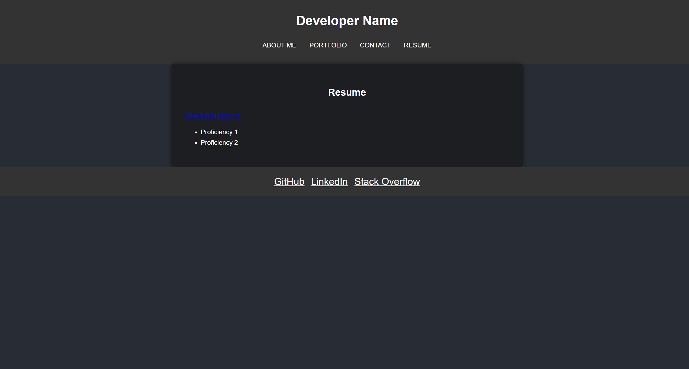

# React Portfolio

## Description

This is a personal portfolio website built using React. It showcases my projects, skills, and contact information. The website is designed to provide potential employers and collaborators with a comprehensive view of my work and capabilities.

## Table of Contents

- [Description](#description)
- [Installation](#installation)
- [Usage](#usage)
- [Features](#features)
- [Screenshots](#screenshots)
- [Contributing](#contributing)
- [Contact](#contact)

## Installation

1. Clone the repository:
    ```sh
    git clone https://github.com/your-username/react-portfolio.git
    cd react-portfolio
    ```

2. Install the dependencies:
    ```sh
    npm install
    ```

3. Start the development server:
    ```sh
    npm run dev
    ```

## Usage

To run the project locally, follow the steps in the [Installation](#installation) section. This will start a development server and you can view the site by navigating to `http://localhost:5173` in your web browser.

To build the project for production, use:
```sh
npm run build
```
The production build will be available in the dist directory.

## Features
- Header: Contains navigation links to different sections of the portfolio.
- About Me: Displays a photo and a short bio.
- Portfolio: Showcases projects with images, titles, and links to live demos and GitHub repositories.
- Contact: Contains a contact form with validation.
- Resume: Provides a downloadable resume and lists proficiencies.
- Footer: Includes links to GitHub, LinkedIn, and other profiles.

## Screenshots





## Contributing
Contributions are welcome! Please open an issue or submit a pull request for any improvements or bug fixes.


## Contact
GitHub: Tylerz3936
LinkedIn: n/a
Email: tylerzhao103@gmail.com